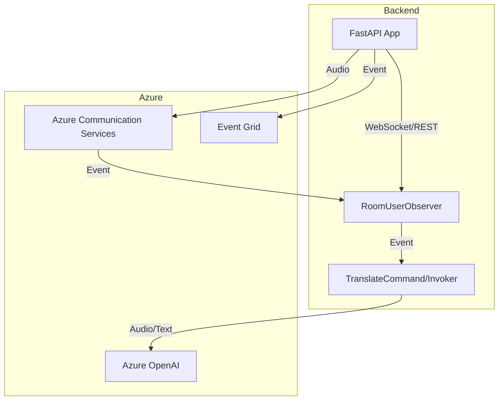

# Live Chat Translation (Orchestrator)

## Overview

Live Chat Translation is a robust, real-time translation backend and frontend system built on Azure OpenAI, Azure Communication Services (ACS), and FastAPI. It enables multi-user, multi-room, audio and text translation with low latency, supporting both text and audio responses. The system is designed for extensibility, maintainability, and enterprise-grade reliability, using the Observer and Command patterns for event and translation orchestration.

## Business Case

**Problem:**
- In global organizations, language barriers hinder real-time collaboration, customer support, and accessibility in meetings, calls, and live events.

**Solution:**
- Live Chat Translation provides seamless, real-time translation for voice and text in multi-user rooms, enabling inclusive communication across languages. It is ideal for:
  - International customer support
  - Multilingual team meetings
  - Accessibility for hearing-impaired users
  - Real-time event translation (e.g., webinars, conferences)

## Architecture

```mermaid
flowchart TD
    subgraph User Devices
        A1[Web Client 1] -- Audio/Text --> B1
        A2[Web Client 2] -- Audio/Text --> B1
    end
    B1[FastAPI Backend (WebSocket/REST)]
    B1 -- Audio/Text --> C1[Azure OpenAI Realtime API]
    B1 -- Audio --> C2[Azure Communication Services (ACS)]
    B1 -- Events --> C3[Event Grid]
    C2 -- Call Events --> B1
    B1 -- Translated Audio/Text --> A1
    B1 -- Translated Audio/Text --> A2
```

### Component Diagram


## Getting Started

### Prerequisites
- Python 3.12+
- Azure Subscription with:
  - Azure OpenAI resource
  - Azure Communication Services (ACS)
  - Event Grid
- (Optional) Node.js for frontend
- [uv](https://docs.astral.sh/uv/getting-started/installation/) for fast Python installs

### Installation
1. Clone the repository:
   ```pwsh
   git clone https://github.com/your-org/realtime-translation.git
   cd realtime-translation
   ```
2. Set up Python environment:
   ```pwsh
   uv venv
   uv pip install -r src/backend/poetry.lock
   ```
3. Copy and fill in environment variables:
   ```pwsh
   cp src/backend/.env.example src/backend/.env
   # Edit src/backend/.env with your Azure keys and endpoints
   ```
4. Deploy Azure resources (optional, for IaC):
   ```pwsh
   az deployment sub create --location <region> --template-file infra/main.bicep
   ```

### Running the Backend
1. Start the FastAPI backend:
   ```pwsh
   uvicorn src.backend.orchestrator.main:app --reload --host 0.0.0.0 --port 8000
   ```
2. (Optional) Start the frontend:
   ```pwsh
   cd src/frontend
   npm install
   npm run dev
   ```

## Testing the API (without Postman)

You can use the [httpie](https://httpie.io/) CLI or curl to test endpoints. For local Event Grid testing, see [Azure Docs: Local Testing Event Grid](https://github.com/MicrosoftDocs/azure-docs/blob/main/articles/communication-services/how-tos/event-grid/local-testing-event-grid.md). Example:

```pwsh
# Simulate Event Grid subscription validation
http POST http://localhost:8000/incoming-call < eventgrid-validation.json

# Simulate ACS callback event
http POST http://localhost:8000/api/callbacks/test-context < acs-callback.json
```

You can also use the built-in OpenAPI docs at [http://localhost:8000/docs](http://localhost:8000/docs) to interactively test all endpoints.

## Key Endpoints
- `POST /chat/start` — Start a new session
- `POST /chat/message` — Send text/audio for translation
- `POST /chat/stop` — End a session
- `WS /ws/audio` — Real-time audio streaming
- `POST /incoming-call` — Handle ACS incoming call events
- `POST /api/callbacks/{contextId}` — Handle ACS callback events

## Extensibility & Patterns
- **Observer Pattern:** For user/room/call state and event handling
- **Command Pattern:** For translation logic and orchestration
- **Session/WebSocket Mapping:** Ensures correct routing of translation and events
- **Bicep IaC:** For Azure resource provisioning (VNet, ACS, Event Grid, Log Analytics)

## Security & Best Practices
- All secrets and keys are managed via environment variables
- Uses Azure best practices for diagnostics, VNet integration, and resource isolation
- Logging and health checks are provided for monitoring

## Contributing
See [CONTRIBUTING.md](CONTRIBUTING.md) for guidelines.

## License
See [LICENSE.md](LICENSE.md).
