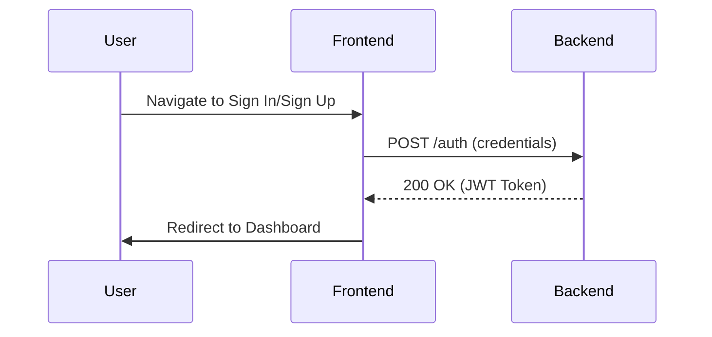
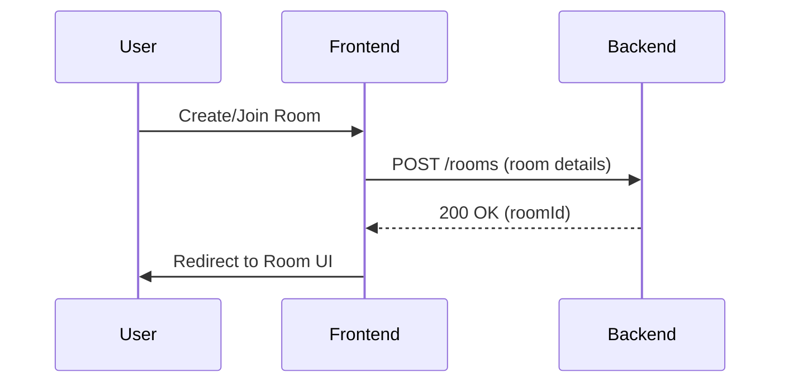
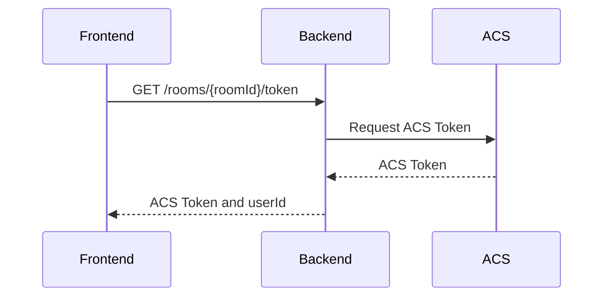
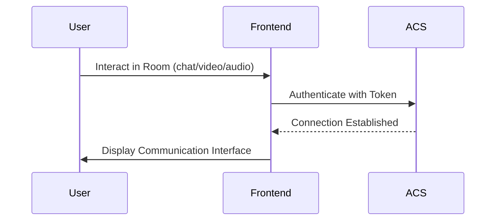

# Real-Time Translation App

## Overview

This app facilitates real-time communication using Azure Communication Services (ACS). It provides a modern UI for room management and communication, integrated with a backend for ACS token/userId retrieval and room orchestration.

## Features

- **User Authentication**: Sign in or sign up to access the app.

- **Room Management**: Create, view, or join rooms.

- **Token Retrieval**: Fetch ACS tokens and userId for authentication.

- **Real-Time Communication**: Chat, video, and audio interactions using Azure Communication UI Library.

## User Flow

1. **User Authentication**:

   - Users sign in or sign up via the authentication pages.

   - Upon successful authentication, users are redirected to the main dashboard or a specific room.

2. **Room Management**:

   - Users can create, view, or join rooms using the backend APIs integrated into the frontend.

   - The room UI fetches room details and participants.

3. **Token Retrieval**:

   - When a user joins a room, the frontend fetches an ACS token and userId using the `getRoomToken` API.

   - The token is used to authenticate the user with Azure Communication Services.

4. **Real-Time Communication**:

   - The room UI uses the Azure Communication UI Library to provide a modern communication interface.

   - Users can interact with other participants in the room via chat, video, or audio.

## Sequence Diagrams

### 1. User Authentication

### 2. Room Management

### 3. Token Retrieval

### 4. Real-Time Communication

## File Structure

### Backend

- **`room/`**: Room management logic using Azure Communication Rooms SDK.

  - `room.py`: Room management logic.

  - `main.py`: FastAPI endpoints for room management.

- **`orchestrator/`**: Orchestrator-related logic.

  - `main.py`: Orchestrator endpoints.

### Frontend

- **`utils/api.ts`**: Room API functions for frontend.

- **`app/room/[roomId]/page.tsx`**: Room UI using Azure Communication UI Library.

## Pending Tasks

1. Finalize user flow explanations and create sequence diagrams using Mermaid for the app.

2. Test the updated frontend to ensure seamless integration with the backend room API.

3. Clean up unused imports and minor warnings in `page.tsx`.
